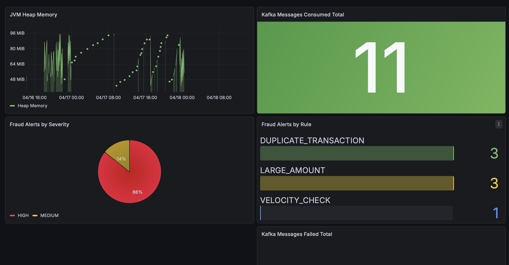

# fraud-detection-service

An event-driven fraud detection microservice built with **Java 21**, **Spring Boot 3**, and **Apache Kafka**, designed to complement [banking-core-api](https://github.com/visurachan/banking-core-api). It consumes transaction events in real time, evaluates them against a rule engine, persists fraud alerts, and exposes them via a REST API with live observability through Prometheus and Grafana.

---
## Architecture


## How It Works

When a transaction completes in `banking-core-api`, a `TransactionCreatedEvent` is published to a Kafka topic. This service consumes that event, runs it through all fraud rules simultaneously, and if any rule triggers, saves a `FraudAlert` with the full rule evaluation results to PostgreSQL.

---

## Tech Stack

| Layer | Technology                      |
|---|---------------------------------|
| Language | Java 21                         |
| Framework | Spring Boot 3.5                 |
| Messaging | Apache Kafka                    |
| Database | PostgreSQL                      |
| Caching | Redis                           |
| Migrations | Flyway                          |
| Observability | Prometheus, Grafana, Micrometer |
| Containerisation | Docker Compose                  |
| Build Tool | Maven                           |
| Utilities | Lombok                          |
| Documentation | Swagger / OpenAPI               |

---

## Fraud Rules

The rule engine evaluates every incoming transaction against all rules. If any rule triggers, a `FraudAlert` is saved with `OPEN` status and all rule results are persisted linked to that alert via foreign key.

| Rule | Trigger Condition                                                | Severity |
|---|------------------------------------------------------------------|---|
| `LARGE_AMOUNT` | Transaction amount exceeds £5,000                                | HIGH |
| `VELOCITY_CHECK` | More than 3 transactions from the same account within 60 seconds | HIGH |
| `DUPLICATE_TRANSACTION` | Same amount to the same recipient within 5 minutes               | MEDIUM |
| `OFF_HOURS` | Transaction above £1,000 between 1am and 4am                     | LOW |

Severity escalates to HIGH automatically if 2 or more rules trigger simultaneously.

---

## Architecture Decisions

**Strategy Pattern for the rule engine**
Each fraud rule implements a common `FraudRule` interface with `evaluate()` and `getRuleName()` methods. `FraudEvaluationService` holds a `List<FraudRule>` that Spring populates automatically at startup by collecting all `@Component` beans that implement the interface. Adding a new rule requires only creating a new class — no changes to existing code.

**All rule results persisted per alert**
When a fraud alert is created, all rule results (triggered and non-triggered) are saved to `fraud_rule_results` linked to the alert via foreign key. This gives fraud analysts the full evaluation context — not just which rule fired, but what else was evaluated at the same time.

**Redis for fraud rule checks**
Two fraud rules use Redis — the velocity rule uses atomic increment with automatic key expiry to track transaction frequency per account within a sliding 60 second window, and the duplicate rule uses `setIfAbsent` to store a transaction fingerprint with a 5 minute expiry to detect repeated transactions to the same recipient.

**Dead Letter Topic (DLT)**
Failed Kafka messages are retried twice with a 1 second backoff before being routed to `transaction.created.DLT`. This ensures no transaction events are silently dropped on processing failure.

**Custom Micrometer metrics**
Rather than relying only on generic JVM and HTTP metrics, custom counters are registered in `FraudEvaluationService` to track fraud alerts by rule and severity, Kafka messages consumed, and Kafka messages failed. These are exposed via `/actuator/prometheus` and visualised in Grafana.

**Known improvement**
Kafka events are currently published within the `@Transactional` boundary in `banking-core-api`. A production improvement would be to use `@TransactionalEventListener` to guarantee events are only published after a successful database commit, eliminating the risk of publishing an event for a transaction that later rolls back.

---

## Observability

Prometheus scrapes `/actuator/prometheus` every 15 seconds. Grafana reads from Prometheus and displays a live dashboard including:

- Fraud alerts triggered by rule (bar gauge)
- Fraud alerts by severity (pie chart)
- Kafka messages consumed (stat)
- Kafka messages failed (stat)
- JVM heap memory over time (time series)

Grafana runs at `http://localhost:3000` (admin/admin) when the stack is running locally.


---

## API Endpoints

Swagger UI available at `http://localhost:8081/swagger-ui/index.html`

| Method | Endpoint | Description |
|---|---|---|
| GET | `/api/v1/fraud/alerts` | Paginated list of all fraud alerts |
| GET | `/api/v1/fraud/alerts/{id}` | Single fraud alert by ID |
| GET | `/api/v1/fraud/alerts/account/{accountId}` | All alerts for a specific account |
| PATCH | `/api/v1/fraud/alerts/{id}/status` | Update alert status (OPEN, REVIEWED, DISMISSED) |
| GET | `/api/v1/fraud/stats` | Fraud summary statistics by severity and rule |

---

## Running Locally

### Prerequisites

- Java 21
- Docker and Docker Compose
- Maven
- [banking-core-api](https://github.com/visurachan/banking-core-api) running on port 8080

### Steps

```bash
# Clone the repo
git clone https://github.com/visurachan/fraud-detection-service.git
cd fraud-detection-service

# Start all infrastructure
docker compose up -d

# Run the application
./mvnw spring-boot:run
```

The service starts on port `8081`.

### Infrastructure ports

| Service | Local Port |
|---|---|
| fraud-detection-service | 8081 |
| PostgreSQL | 5434 |
| Redis | 6380 |
| Kafka | 9092 |
| Prometheus | 9090 |
| Grafana | 3000 |

### Environment

The default `application.yml` is configured for local Docker Compose setup. No additional environment variables are required to run locally.

---

## Related Projects

| Project | Description |
|---|---|
| [banking-core-api](https://github.com/visurachan/banking-core-api) | Core banking monolith that publishes transaction events consumed by this service |